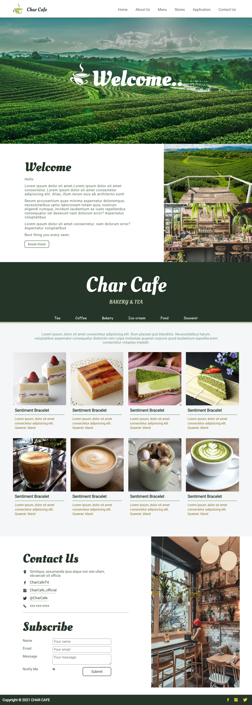

# Web Design and Development

Thai-Nichi Institute of Technology (泰日工業大学)  
ITE-301 Web Design and Development : Semester 1/2021  
WD02 group project

## Requirements

- Visual Studio Code (vscode). `vscodium alternate of vscode`
- GitHub account [sign up](https://github.com/).
- GitHub desktop [download here](https://desktop.github.com/).

### Extensions

- Live server
- HTML End Tag Labels
- IntelliSense for CSS class names in HTML
- CSS Peek
- Auto Rename Tag

## 📦 Development

### GUI

1. Click drop down `code` button on top of this repository.
2. Open with GitHub Desktop.
3. Clone this repository to your local drive
4. Open in Visual Studio Code.

### CLI

```sh
$ git clone https://github.com/pichayakorn/wd02-charcafe.git
$ cd wd02-charcafe
$ code .
```

## 🛠️ Contributors

<a href="https://github.com/pichayakorn/wd02-charcafe/graphs/contributors">
  
</a>

## 🛡️ License

MIT license

Check out [LICENSE](/LICENSE) for more detail.

## 📷 Screenshot


